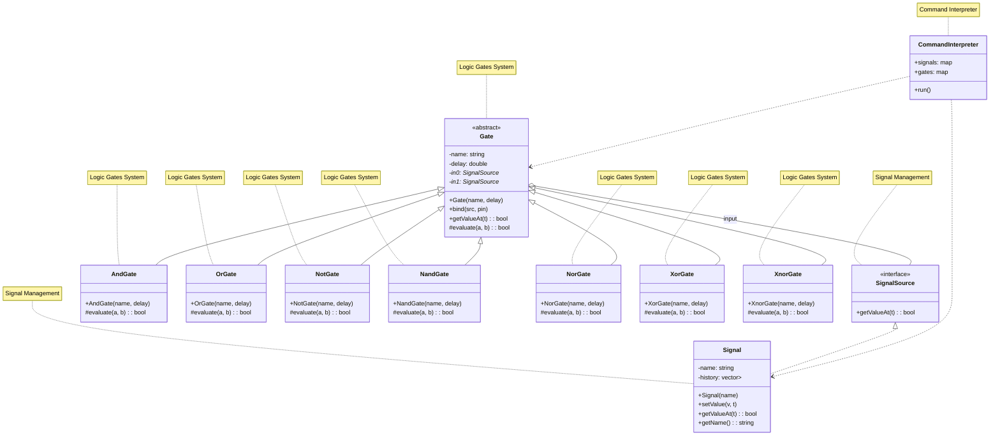

# Simulating-Propagation-Delays-in-Digital-Logic-Gates


## 特色功能

- 支援多種邏輯閘（AND、OR、NOT、NAND、NOR、XOR、XNOR）
- 可自訂訊號並設定任意時刻的值
- 支援訊號與閘的綁定，自由組合電路結構
- 支援 propagation delay（訊號傳遞延遲）
- 可查詢任意時刻 Gate 的輸出（歷史追蹤）
## 基本使用方式
啟動程式後，於命令列依下列格式輸入指令：

```bash
Add signal <名稱>                # 新增訊號
Add AND <閘名稱>                 # 新增 AND 閘（其他閘類型同理）
Set <訊號名稱> <True/False> <t>  # 設定某訊號在 t 時刻的值
Bind <來源> <目標閘> <pin>       # 將來源訊號/閘綁定至閘的第 pin 腳
Query <閘名稱> <t>               # 查詢閘在 t 時間點的輸出
EXIT                             # 離開程式
```

## 範例流程
```bash
Add signal a
Add signal b
Add AND g1
Set a True 0
Set b False 0
Bind a g1 0
Bind b g1 1
Query g1 10
```
## SignalSource（介面／抽象基底類別）
- SignalSource 是所有訊號來源的抽象介面（以 struct 搭配純虛擬函式實作），定義了 getValueAt(t) 方法，並在Siganl 和 Gate 上 override。
- 這樣設計能讓所有訊號來源（包括原始訊號、各種邏輯閘）都能以一致的方式被查詢，
- 體現了 C++ 的介面設計與多型（polymorphism），方便擴充與重用。
## Signal（訊號類別，繼承自 SignalSource）
- Signal 類別代表可設定時間歷史的輸入訊號，繼承自 SignalSource。
- 具備「封裝」特性，將訊號名稱與時間歷史儲存在私有成員中，並透過成員函式進行資料存取。
## Gate（抽象邏輯閘基底類，繼承自 SignalSource）
- Gate 是所有邏輯閘的抽象基底類別，繼承自 SignalSource，實作了延遲處理與輸入管理，
- 宣告一個純虛擬函式 evaluate(a, b) 讓子類別覆寫，
- 使各種邏輯閘能以統一介面被操作，且便於擴充不同邏輯功能。
## 各種 Logic Gate（繼承 Gate）
- 這些類別皆繼承自 Gate，並各自實作（覆寫）evaluate 方法以對應不同邏輯運算。
- AndGate 的 evaluate 回傳兩輸入皆為 True 時才為 True，
